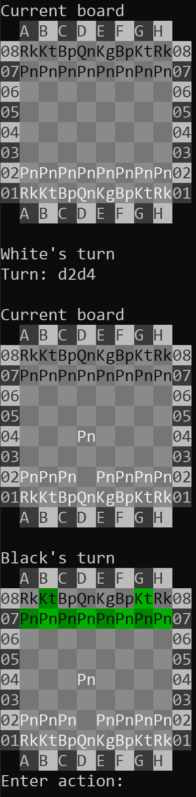
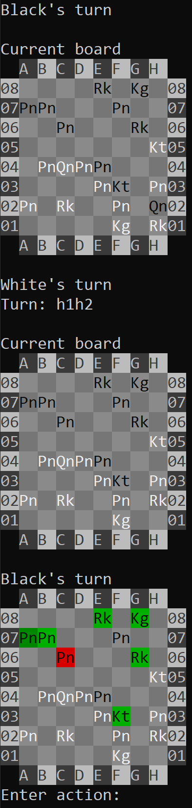
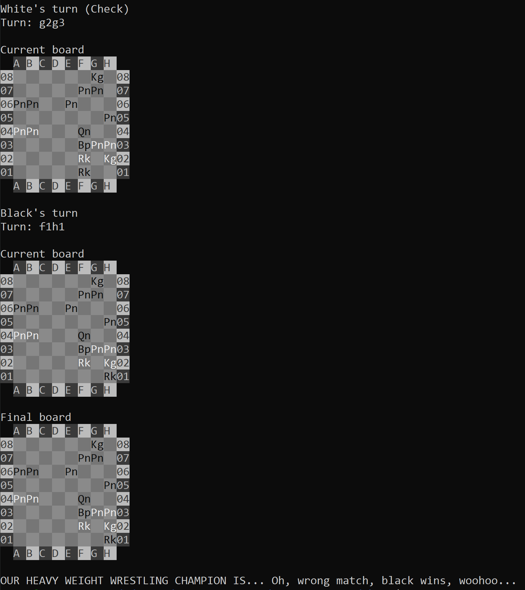

# Chess

Welcome to Chess!

Who doesn't love a good game of [chess](https://en.wikipedia.org/wiki/Chess)? probably less intelligent people. Up for a
quick match with a friend? Got no friends and need to play against the computer? OK...

Come play with Chess! You can play locally with a close friend, remotely with an old acquaintance, or with a hard, cold,
heartless machine!

## Getting Started

First off clone this project, after that you'll need to install a couple of requirements, and than you'll only need to
build it and enjoy the ride.

### Prerequisites

The packages required for building the project are:
gcc, cmake.

```shell script
apt install gcc cmake
```

For using the Python game fetch script, or the Stockfish player, install `requirements.txt`.

```shell script
pip3 install -r requirements.txt
```

For the Stockfish player, downloading a Stockfish executable is required, the executables are available for downloading
[here](https://stockfishchess.org/download/).

### Configuring

* Displaying threatened pieces, hints, and autofill can be configured [here](config.h).

### Building

After installing all the requirements, building the project is as straight-forward as it can be.

```
cmake .
make
```

That's it!

### Usage

Chess takes 4 keyword arguments, all 4 are optional: `--white`, `--black`, `--turns`, and `--walk-through`.

* `--white` is the definition of the white player, the player's definition consists of 3 parts: `TYPE[:HOST:PORT]`. The
  types of players are:
    * Local - defined with `local`, the player is local, and gets the turns from stdin.
    * Client - defined with `client:HOST:PORT`, the player is a client, connects and gets the turns from the server.
    * Server - defined with `server:HOST:PORT`, the player is a server, accepts and gets the turns from the client.

  The default value for the white and black players is `local`.

  So you can for example play the white player, and wait for the black player to connect
  with: `--white local --black server:0.0.0.0:5678`, and the black player can connect
  with `--white client:0.0.0.0:5678 --black local`. This also allows for tunneling players without even playing, so you
  can have 2 players, and multiple stale players that only watch the game.
* `--black` is the definition of the black player, see the description of `--white`.
* `--turns` are the turns performed from the initial board's state to the desired state of the game to start with, in
  [UCI](https://en.wikipedia.org/wiki/Universal_Chess_Interface) format. For example `--turns d2d4`, defined the board's
  start state after the white player moved one of his pawns.

  **Note: One player at most can set `--turns`.**
* `--walk-through` causes the game to pause after each turn specified with `--turns`, for a walk-through of the game up
  to the desired start state.

When playing locally, in your turn you can:

1. Enter the source and destination.
2. Enter `u` to deselect source or destination.
3. Enter `p` to print the turns up to current board.
4. Enter `q`, `ESC`, or `DEL` to quit the game.

The python game fetching script takes one optional keyword argument: `--id` - The ID of the game in
[ChessGames](https://www.chessgames.com/) to fetch, for example:

```text
>>> python3 scripts/get_game.py --id 1924099

Retrieving chess game 1924099.
d2d4 d7d5 g1f3 g8f6 c2c4 e7e6 b1c3 b8d7 c4d5 e6d5 c1f4 c7c6 e2e3 f8e7 h2h3 e8g8 f1d3 f8e8 e1g1 d7f8 a1c1 f8g6 f4h2 e7d6 h2d6 d8d6 d1b3 e8e7 c1c2 f6e4 d3e4 d5e4 f3g5 c8f5 g2g4 f5e6 g5e6 e7e6 c3e2 g6h4 e2g3 e6e7 b3c4 a8e8 f1c1 h4f3 g1g2 g7g6 b2b4 h7h5 g4h5 d6f6 c4e2 g6h5 g3h5 f6d6 c1h1 e7e6 e2c4 e6g6 g2f1 d6h2
```

If `--id` is not specified - the scripts guesses numbers and tries to retrieve a random game.

The python Stockfish player script takes 6 keyword arguments, 1 is required, all other are optional: `--white`,
`--black`, `--skill-level`, `--depth`, `--turns`, `--stockfish`.

The specification of either `--white` or `--black` is required.

* `--black` is the definition of the black player, see above for format, `local` is not an option, since the player not
  specified, is player by the Stockfish player.
* `--white` is the definition of the black player, see the description of `--white`.
* `--skill-level` is Stockfish's engine skill level.
* `--depth` is Stockfish's engine depth.
* `--turns` are the turns performed from the initial board's state to the desired state of the game to start with, see
  above for the format.
* `--stockfish` is the path for the Stockfish executable, searches for `./stockfish` by default.

For example:

```shell script
python3 scripts/stock.py --white server:localhost:5678 --stockfish ./stockfish_20090216_x64
```

### Test Run

Now try using Chess, take it for a test run, for example:

```text
# Start a Stockfish player in the background.
>>> python3 scripts/stock.py --white server:localhost:5678 --stockfish ./stockfish_20090216_x64 > /dev/null &
# Play against that player.
>>> ./chess --white client:127.0.0.1:5678
```



Some more screenshots of the game:



Viewing a game between two stockfish engines:

```text
>>> python3.8 scripts/stock.py --white server:localhost:5678 --stockfish ./stockfish_20090216_x64 --skill-level 20 > /dev/null &
>>> python3.8 scripts/stock.py --black server:localhost:5679 --stockfish ./stockfish_20090216_x64 --depth 10 > /dev/null &
>>> ./chess --white client:127.0.0.1:5678 --black client:127.0.0.1:5679
```



## Technologies and Capabilities

* Chess is written in [C++](https://en.wikipedia.org/wiki/CPP) (and
  [Python](https://en.wikipedia.org/wiki/Python_(programming_language)) 3.8 for the scripts).
* Supports playing locally, remotely, or against a Stockfish engine. Allowing many variations of playing, viewing, and
  sharing games, with every combination.
* Scans the board and collects all possible options for the turn, allowing to choose only valid moves.
* Supports auto-completion for piece moving according to what is possible at that turn.
* Supports colored output to show pieces that are movable, pieces that are threatened, and where the pieces can move.
* Supports check mate, quitting, and printing the moves played for continuing games.
* Supports step by step progress viewing of the game for learning and tracking mistakes.
* Supports all complicated moves: [Castling](https://en.wikipedia.org/wiki/Castling),
  [En passant](https://en.wikipedia.org/wiki/En_passant), and
  [Promotion](https://en.wikipedia.org/wiki/Promotion_(chess)). 
* Implements a python code which uses [Stockfish](https://pypi.org/project/stockfish/) for playing against a Stockfish
  engine, and another script that uses [requests](https://pypi.org/project/requests/) and
  [chess](https://pypi.org/project/chess/) for retrieving games from [ChessGames](https://www.chessgames.com/).

## Documentation

The C++ code is thoroughly documented, using
[LSST DM Developer Guide](https://developer.lsst.io/cpp/api-docs.html#documenting-c-code) format.

The Python code is documented using [Google Python Style Guide](https://google.github.io/styleguide/pyguide.html)
format.

I hope that it can answer whichever questions that may arise.

## Contributing

Feel free to contact me if you have any comments, questions, ideas, and anything else you think I should be aware of.
Also, tell me what legendary matches have been played with Chess, or how playing against Stockfish improved your strategy,
I'd love to know.

## Authors

* [**Uriya Harpeness**](https://github.com/UriyaHarpeness)

## Acknowledgments

* I would like to thank my wife - Tohar Harpeness, my son - Amittai Harpeness, my parents, my computer, and my free
  time, for enabling me to work on this small project, it has been fun.

* I thank [Stockfish](https://stockfishchess.org/) for giving me the option to play against a skilled computer player,
  and not trying to outsmart myself in the process of developing, and for always losing to.

* I thank [ChessGames](https://www.chessgames.com/) for their simple API and database of many chess games to take
  inspiration from, and seeing many games with various moves. 
